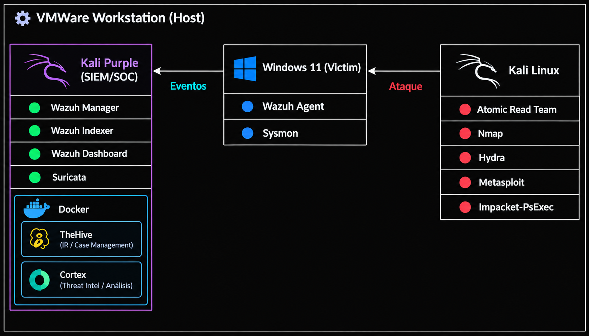
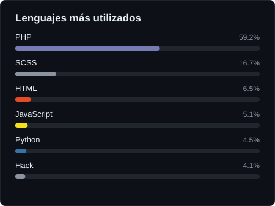

# Soy Tadeo 👋

### Ciberseguridad | Blue Team | SOC | Red Team | Programación

---

## 👨‍💻 Sobre mí

Soy un apasionado de la ciberseguridad, orientado al análisis de seguridad y a las operaciones de un **SOC (Security Operations Center)**.

Desarrollo proyectos prácticos para fortalecer mis conocimientos en monitoreo de eventos, detección de amenazas, análisis de incidentes y seguridad defensiva.

También cuento con conocimientos de **Red Team y seguridad ofensiva**, incluyendo reconocimiento, análisis de vulnerabilidades, pruebas de penetración y simulación de ataques en entornos controlados. Estos conocimientos me permiten comprender las técnicas utilizadas por los atacantes y aplicarlas al desarrollo de estrategias de detección y defensa.

Además, poseo conocimientos de programación y desarrollo web, que complemento con mi formación en ciberseguridad.

---

## 🛡️ Tecnologías y herramientas

### Blue Team / SOC

### Red Team / Pentesting

### Programación y desarrollo

---

## 🚀 Proyectos destacados

### 🛡️ Laboratorio SOC – Blue Team & Red Team

**Simulación de ataques, detección de amenazas y análisis de incidentes.**

Laboratorio de ciberseguridad desarrollado en un entorno virtualizado con **VMware Workstation**, diseñado para simular las operaciones de un Centro de Operaciones de Seguridad (SOC).

El proyecto integra herramientas de **Blue Team** para el monitoreo, detección y análisis de amenazas, junto con un entorno **Red Team** destinado a la ejecución de ataques controlados y la evaluación de su visibilidad en la infraestructura defensiva.

**Tecnologías principales:** Wazuh, Suricata, Sysmon, TheHive, Cortex, Kali Purple, Kali Linux y Windows 11.

**Documentación del proyecto:**

- **Fase 1 – Infraestructura defensiva:** Implementación y configuración de la infraestructura virtualizada, las herramientas de monitoreo y los componentes de seguridad.

- **Fase 2 – Simulación de ataques:** Ejecución de ataques controlados desde Kali Linux, recopilación de evidencias y análisis de los eventos generados en la infraestructura defensiva.

**[Ver repositorio completo](https://github.com/TadeoPoli/Laboratorio-SOC)**

---

## 💻 Desarrollo de software

Además de mi formación en ciberseguridad, desarrollo aplicaciones web y proyectos de programación que me permiten fortalecer mis conocimientos de desarrollo Full-Stack y Front-End.

### 🏠 BienesRaices – FullStack

Aplicación web inmobiliaria desarrollada con **PHP y arquitectura MVC**, que permite administrar propiedades, vendedores y usuarios mediante una base de datos MySQL.

Este es uno de mis proyectos más completos de desarrollo web, en el que aplico conocimientos de programación, bases de datos y arquitectura de software.

**Tecnologías utilizadas:**

**[Ver repositorio de BienesRaices](https://github.com/TadeoPoli/BienesRaices-FullStack)**

### 📂 Otros proyectos de programación

También cuento con proyectos de menor escala, principalmente orientados al desarrollo Front-End, en los que he trabajado con HTML, CSS y JavaScript para practicar y ampliar mis conocimientos de desarrollo web.

---

## 📊 Lenguajes más utilizados

---

## 📫 Contacto

Podés encontrarme en LinkedIn para conocer más sobre mi perfil profesional y mis proyectos.

